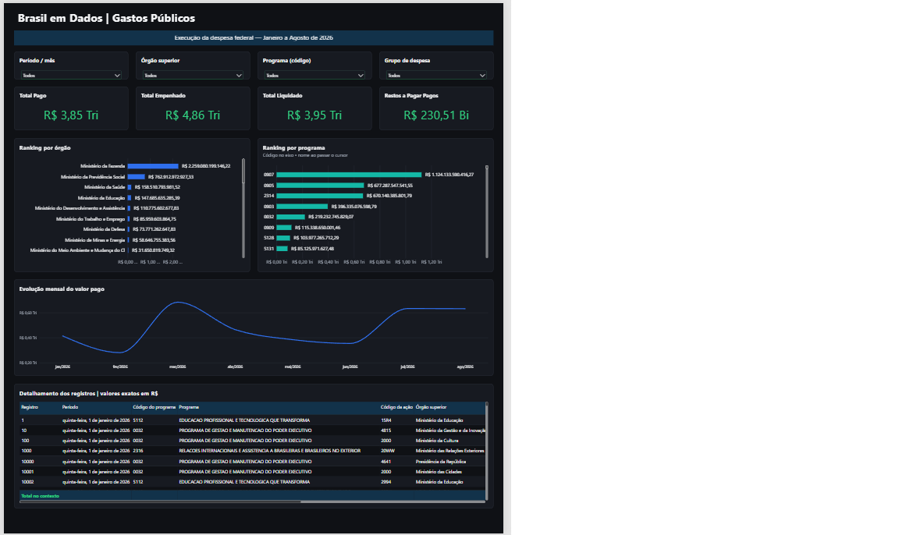
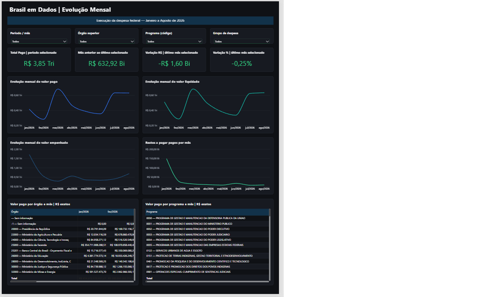
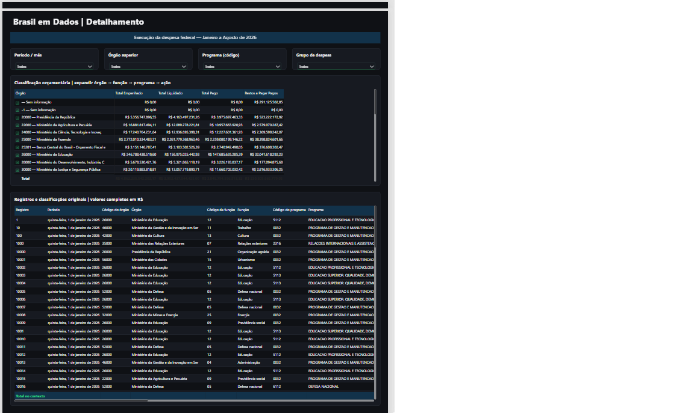

# Brasil em Dados | Gastos Públicos

Tive a ideia do Brasil em Dados para colocar em prática meus conhecimentos em SQL e análise de dados. Queria trabalhar com uma base pública real, em vez de dados fictícios, e escolhi os arquivos de gastos públicos federais disponibilizados pelo Portal da Transparência. Durante o desenvolvimento, também utilizei Python, DuckDB e Power BI para transformar esses arquivos em uma análise interativa.

Comecei pelo arquivo de janeiro de 2026, com **48.519 registros**. A intenção era trabalhar primeiro com uma base menor: entender a estrutura dos dados, tratar e organizar as informações, escrever as consultas, conferir os valores e construir a primeira versão do dashboard.

Antes de acrescentar outros meses, realizei testes de carregamento e verifiquei as medidas financeiras, as agregações e a consistência entre os resultados. As reconciliações apresentaram diferença de **R$ 0,00**. Essas verificações avaliaram o processamento e a consistência interna do projeto; não foram uma auditoria da veracidade dos dados públicos nem uma comprovação de que os arquivos abrangem toda a execução federal.

Só depois dessa etapa ampliei o projeto para **janeiro a agosto de 2026**, chegando a **495.572 registros** na base consolidada. Segui a ideia de validar primeiro em uma base menor e, com os resultados conferidos, ampliar o processamento para os demais meses.

O dashboard acompanhou essa evolução. A análise de um único mês passou a incluir evolução mensal, comparação entre períodos e rankings por órgão e programa. Hoje, posso explorar os valores empenhados, liquidados e pagos, consultar os pagamentos de restos a pagar separadamente e navegar pelo detalhamento por órgão, função, programa e ação.

Atualmente, reúno **Python, SQL, DuckDB, Power BI e Git/GitHub** no projeto, trabalhando com dados públicos reais desde a leitura dos arquivos até a apresentação dos resultados.

## Período e resultados

| Indicador | Janeiro a agosto de 2026 |
| --- | ---: |
| Registros | **495.572** |
| Valor empenhado | **R$ 4,86 tri** |
| Valor liquidado | **R$ 3,95 tri** |
| Valor pago do exercício | **R$ 3,85 tri** |
| Restos a pagar pagos | **R$ 230,51 bi** |

Os valores acima estão arredondados para facilitar a leitura. As medidas e a base mantêm os valores exatos, incluindo centavos e registros negativos.

Empenho, liquidação e pagamento representam etapas diferentes da execução: **não devem ser somados entre si**. Os pagamentos de restos a pagar também são apresentados separadamente dos pagamentos do exercício.

Os rankings consideram os órgãos presentes na base, sem restrição ao Ministério da Fazenda. A reconciliação interna dos resultados não comprova, isoladamente, a completude de toda a execução federal.

## Dashboard

O modelo multimensal foi carregado e aprovado funcionalmente no Power BI Desktop. As três páginas compartilham filtros de período, órgão, programa e grupo de despesa.

### Visão Geral

Reúne os quatro indicadores financeiros, rankings por órgão e programa e a evolução mensal do valor pago. Permite comparar a composição dos pagamentos no período selecionado.



### Evolução Mensal

Apresenta as séries de pagamentos, empenhos, liquidações e restos a pagar pagos, além dos indicadores de mês anterior e variação mensal. As matrizes permitem acompanhar órgãos e programas ao longo dos meses.



### Detalhamento

Permite navegar pela hierarquia de órgão, função, programa e ação e consultar os registros com suas classificações e valores completos.



## Fonte e tecnologias

Os dados são do [Portal da Transparência — Execução da Despesa](https://portaldatransparencia.gov.br/download-de-dados/despesas-execucao). O processamento parte dos arquivos mensais em ZIP. O arquivo inicial de janeiro contém um CSV com 47 colunas, separador `;` e codificação estimada cp1252; o cabeçalho e a leitura precisam ser conferidos a cada nova carga.

- **Python:** inspeção dos arquivos, leitura em lotes, carga, exportação e verificações.
- **DuckDB e SQL:** armazenamento local, transformações, consultas e reconciliação financeira.
- **Power BI:** importação com Power Query, calendário explícito, medidas DAX e relatório interativo em PBIP, TMDL e PBIR.
- **Git/GitHub:** versionamento do código, da documentação e das definições do Power BI.

Os dados brutos, CSVs, banco local e ambiente virtual não são distribuídos pelo repositório.

## Como os dados chegam ao painel

```text
ZIPs mensais do Portal da Transparência
    → Python: leitura e conferência dos arquivos
    → DuckDB: staging com campos como texto
    → SQL: conversão e tabela analítica
    → SQL e Python: exportação e reconciliação dos CSVs
    → Power Query → modelo com Calendario e medidas DAX → dashboard
```

A tabela principal conserva a granularidade dos registros e os códigos como texto, inclusive zeros à esquerda. Isso permite combinar filtros sem perder a identidade dos programas ou juntar códigos diferentes apenas porque têm o mesmo nome.

Os valores brasileiros são convertidos para `DECIMAL(20,2)`: vazio permanece `NULL`, zero permanece zero e valores negativos são preservados. As agregações por órgão, programa e ação são visões alternativas; **não devem ser anexadas nem somadas à tabela principal**.

## Estrutura do projeto

```text
src/                         # Inspeção, carga, exportação e ferramentas Power BI
sql/                         # Transformações e consultas analíticas
  powerbi/                   # Projeção principal e agregações alternativas
tests/                       # Testes com arquivos fictícios e verificações de integridade
docs/                        # Arquitetura, metodologia e documentação
  images/                    # Capturas das três páginas do dashboard
data/                        # Dados locais, ignorados pelo Git
  raw/                       # ZIPs de entrada
  processed/                 # CSVs e artefatos locais
powerbi/
  Brasil_em_Dados.pbip
  Brasil_em_Dados.Report/
  Brasil_em_Dados.SemanticModel/
requirements.txt
RESULTADOS_JANEIRO_2026.md     # Registro da validação inicial de janeiro
```

A [arquitetura](docs/ARQUITETURA.md), a [metodologia](docs/METODOLOGIA.md) e os [resultados de janeiro](RESULTADOS_JANEIRO_2026.md) registram a etapa inicial do projeto. Seus números e instruções específicos de janeiro não representam o consolidado de oito meses.

## Instalação e execução

É necessário ter Python, Git e Power BI Desktop compatível com PBIP, TMDL e PBIR. Em PowerShell, na raiz do repositório:

```powershell
python -m venv .venv
.\.venv\Scripts\python.exe -m pip install -r requirements.txt
.\.venv\Scripts\python.exe -m unittest discover -s tests -v
```

Para inspecionar um arquivo local, sem alterar o ZIP:

```powershell
.\.venv\Scripts\python.exe -X utf8 src\inspect_data.py data\raw\202601_Despesas.zip
```

**Estado desta cópia:** o projeto Power BI está atualizado para janeiro a agosto, mas os scripts Python e SQL aqui presentes ainda correspondem à etapa anterior. Os comandos abaixo reproduzem a carga inicial de janeiro; não geram, por si só, o consolidado de oito meses:

```powershell
.\.venv\Scripts\python.exe -X utf8 src\load_data.py data\raw\202601_Despesas.zip
.\.venv\Scripts\python.exe -X utf8 src\export_powerbi.py
```

Essa carga cria o banco em `data/brasil_em_dados.duckdb` e substitui o snapshot de forma transacional. Não execute essa rotina sobre um banco multimensal que queira preservar. Para reproduzir o painel atual desde os ZIPs, ainda é necessário sincronizar a versão multimensal do pipeline com esta cópia.

## Consultas SQL e transformações

- `sql/01_build_analytics.sql`: construção da tabela analítica e conversão dos valores monetários para decimal.
- `sql/02_count.sql` a `sql/06_top_acoes.sql`: contagens, totais e rankings da etapa inicial, com filtros de janeiro.
- `sql/07_quality.sql` a `sql/09_dimensions.sql`: verificações de qualidade, registros iguais e dimensões.
- `sql/powerbi/`: preparação da tabela principal e das agregações para exportação.

As consultas com filtros de janeiro devem ser lidas como parte da validação histórica, não como consultas do total acumulado de janeiro a agosto.

## Abrir e configurar o Power BI

1. Disponibilize o CSV consolidado de janeiro a agosto em `data/processed/despesas_bi.csv`.
2. Abra `powerbi/Brasil_em_Dados.pbip` no Power BI Desktop.
3. Em **Transformar dados**, selecione `despesas_bi` e ajuste o caminho da etapa `Fonte` para seu arquivo. A definição atual ainda contém o caminho local do ambiente de desenvolvimento; ele precisa ser configurado em outro computador.
4. Preserve o delimitador `;`, a codificação UTF-8, os códigos como Texto e a leitura numérica com cultura `en-US`. O CSV usa ponto decimal; a apresentação do relatório é em português brasileiro.
5. Atualize o modelo e confira **495.572 registros**, os oito meses e os totais apresentados neste README, considerando o arredondamento dos indicadores.

O modelo tem uma tabela `Calendario` explícita e 12 medidas. `MesAno` é ordenado por `OrdemMes`, mantendo a sequência cronológica. A página de validação também foi preservada.

A classificação auxiliar dos programas de dívida contempla os códigos **0905, 0906, 0907 e 0908**. Ela não substitui o grupo de despesa e não classifica todo o programa 0909 como dívida. Esses programas continuam incluídos nos totais.

## Testes e validações

A conferência combina testes automatizados, reconciliação em SQL e verificação no Power BI Desktop. São verificados códigos textuais, conversões monetárias, negativos, diferença entre vazio e zero, reexecução da carga e correspondência entre tabela principal e agregações.

Na etapa inicial, janeiro teve **48.519 registros**, Total Pago de **R$ 414.272.570.651,27** e diferença de **R$ 0,00** entre a soma dos programas e o total da base. Esse resultado permanece documentado como referência histórica.

Na atualização do Power BI desta cópia, **45 arquivos PBIR passaram nos esquemas locais** e o TMDL foi desserializado com **duas tabelas e 12 medidas**. O modelo multimensal e os gráficos principais foram conferidos no Desktop. A validação estrutural não substitui a execução das medidas e a conferência das interações no aplicativo.

Para executar as verificações disponíveis:

```powershell
.\.venv\Scripts\python.exe -m unittest discover -s tests -v
powershell -NoProfile -ExecutionPolicy Bypass -File src\validate_pbir.ps1 -Candidate powerbi\Brasil_em_Dados.Report\definition\pages
powershell -NoProfile -ExecutionPolicy Bypass -File src\validate_tmdl.ps1
```

Os validadores usam componentes do Power BI Desktop e esquemas locais. A preparação desses esquemas está descrita em [docs/REFINAMENTO.md](docs/REFINAMENTO.md). A suíte desta cópia pertence à etapa anterior e precisa ser revisada junto com a sincronização do pipeline multimensal; não há aqui uma nova contagem de testes aprovados para essa versão.

## Limitações e próximos períodos

- O recorte disponível é janeiro a agosto de 2026; o painel não representa o ano completo.
- A integridade interna não garante que os arquivos cubram toda a execução federal.
- Valores negativos e descrições aparentemente truncadas foram preservados, sem atribuir causas.
- Os totais incluem programas de dívida pública e não equivalem apenas a gastos com serviços públicos.
- A classificação orçamentária identifica a destinação registrada, mas não explica, sozinha, causas econômicas ou políticas, eficácia ou irregularidades.

Para incluir novos meses, a carga deve conferir período, cabeçalho e identidade do arquivo, preservar os meses já validados e evitar duplicação em reexecuções. Antes de atualizar o Power BI, é preciso reconciliar os totais mensais e acumulados e gerar novamente o CSV consolidado. Nesta cópia, essa atualização depende primeiro da sincronização do pipeline multimensal.

## Arquivos locais e versionamento

O GitHub reúne código, documentação, imagens e definições do Power BI. Arquivos brutos, CSVs, bancos DuckDB, credenciais, caches, backups e ambientes virtuais ficam fora do versionamento.

A fonte local do Power BI precisa ser revisada antes de uma nova publicação. Este README orienta a configuração do caminho, mas não modifica a fonte nem remove informações locais dos arquivos TMDL.
