# Arquitetura — Brasil em Dados

## Fluxo local e reproduzível

```mermaid
flowchart LR
    A[ZIP local do Portal da Transparência] --> B[Python: csv e zipfile]
    B --> C[Staging DuckDB: 47 campos em texto]
    C --> D[SQL: tabela despesas e DECIMAL]
    D --> E[SQL: projeção e agregações alternativas]
    E --> F[Python: CSVs e reconciliação]
    F --> G[Power Query: importação local]
    G --> H[TMDL: medidas DAX]
    H --> I[PBIR: validação e Visão Geral]
```

Os scripts não fazem downloads. O ponto de partida é `data/raw/202601_Despesas.zip`, fornecido localmente, com CSV cp1252 e separador `;`. O banco fica em `data/brasil_em_dados.duckdb`.

## Responsabilidades

| Camada | Arquivos | Responsabilidade |
| --- | --- | --- |
| Inspeção | `src/inspect_data.py` | Cabeçalho, codificação estimada, separador e amostra limitada |
| Ingestão | `src/load_data.py`, `src/despesas_columns.json` | Contrato das 47 colunas; carga transacional em lotes |
| Transformação | `sql/01_build_analytics.sql` | Seis medidas monetárias separadas, campos dimensionais preservados |
| Análise | `sql/02_count.sql` a `sql/09_dimensions.sql` | Totais, rankings, registros idênticos e verificações de qualidade |
| Exportação | `sql/powerbi/`, `src/export_powerbi.py` | Tabela principal e três agregações alternativas |
| Modelo | `powerbi/Brasil_em_Dados.SemanticModel/` | Importação M, cinco medidas DAX, cultura pt-BR |
| Relatório | `powerbi/Brasil_em_Dados.Report/` | Página de validação e Visão Geral em PBIR |
| Validação visual | `src/validate_pbir.ps1`, `tests/test_overview.py`, `tests/test_refine_overview.py` | Estrutura, campos, interações e contraste |
| Publicação | `src/prepare_publication.py` | Auditoria e cópia para revisão, sem Git ou rede |

## Granularidade e relações

Uma linha da staging corresponde a um registro do CSV. `_linha_csv` e `id_registro` são identificadores técnicos deste snapshot; não provam identidade de negócio e não são chaves globais para vários meses.

`despesas_bi.csv` conserva todos os registros, permitindo filtros combinados de órgão, função, programa, ação e grupo. A projeção SQL não utiliza joins, DISTINCT ou agregação. As visões por órgão, programa e programa/ação não são dimensões e não devem ser anexadas ou somadas à principal.

O modelo inclui as tabelas automáticas de datas criadas pelo Desktop. Elas e seus relacionamentos foram preservados. Não foram criados relacionamentos para os filtros, pois todos usam `despesas_bi`.

## Reconciliação e recuperação

CSV → staging → analítica: contagens iguais, dimensões intactas, seis somas comparadas com Python Decimal. Exportação: quatro somas reconciliadas e todas as células relidas. Reexecução da carga substitui o snapshot em transação; não duplica registros e reverte em caso de falha.

Backups PBIR ficam em `data/processed/backups/`, fora de `powerbi/` e ignorados pelo Git. Um manifesto registra hashes dos dados, SQLs e modelo preservados. Arquivos candidatos são validados antes da substituição do relatório.

## Formatos, ambiente e publicação

O PBIP referencia o relatório, cujo `definition.pbir` aponta para o modelo por caminho relativo. A importação M referencia um CSV local por caminho absoluto; cada usuário deve configurá-lo. O script de publicação substitui esse caminho por um marcador somente na cópia de distribuição, sem mudar o projeto local.

PBIR é JSON; TMDL exige um desserializador próprio. Esquemas e assemblies do Power BI Desktop instalado permitem validação offline. A aceitação estrutural não substitui testes de renderização, filtros e atualização no aplicativo.

Dados, banco, cache, ambiente virtual, segredos e backups não entram no repositório. Os arquivos de definição, scripts, testes e documentação permitem reconstruir o projeto a partir de uma entrada local válida. Esta etapa não executa Git, commits ou publicação.
